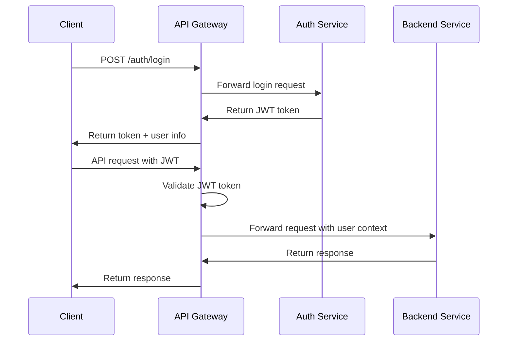

# API Gateway Service Technical Specification

## 🎯 **Service Overview**

The API Gateway Service serves as the single entry point for all client traffic to the LMS microservices ecosystem. It provides centralized authentication, authorization, rate limiting, circuit breaking, and request routing while maintaining high performance and reliability.

### **Core Responsibilities**
- Unified API entry point for all client applications
- JWT-based authentication and authorization
- Request routing to appropriate backend services
- Rate limiting and DDoS protection
- Circuit breaking for service resilience
- Request/response transformation and validation
- Centralized logging and monitoring
- API documentation aggregation
- CORS handling and security headers

### **Service Characteristics**
- **Technology Stack:** Node.js + Fastify + TypeScript
- **Port:** 3000
- **Authentication:** JWT tokens with role-based access control
- **Documentation:** Swagger/OpenAPI 3.0 integration
- **Monitoring:** Structured logging with Pino
- **Resilience:** Circuit breaker pattern with automatic recovery

---

## 🏗️ **Architecture Design**

### **High-Level Architecture**
```
┌─────────────────┐    ┌──────────────────────┐    ┌─────────────────┐
│   Client Apps   │────│   API Gateway        │────│  Auth Service   │
│   Web/Mobile    │    │   (Port 3000)        │    │  (Port 3001)    │
└─────────────────┘    └──────────────────────┘    └─────────────────┘
                                │
                    ┌───────────┼───────────────┐
                    │           │               │
            ┌───────▼───┐ ┌─────▼─────┐ ┌──────▼──────┐
            │   User    │ │  Course   │ │ Assessment  │
            │ Service   │ │ Service   │ │  Service    │
            │(Port 3002)│ │(Port 3003)│ │(Port 3004)  │
            └───────────┘ └───────────┘ └─────────────┘
                    │           │               │
                    └───────────┼───────────────┘
                                │
                    ┌───────────┼───────────────┐
                    │           │               │
            ┌───────▼───┐ ┌─────▼─────┐ ┌──────▼──────┐
            │   File    │ │  Search   │ │Notification │
            │ Service   │ │ Service   │ │  Service    │
            │(Port 3005)│ │(Port 3006)│ │(Port 3007)  │
            └───────────┘ └───────────┘ └─────────────┘
                                │
                        ┌───────▼───────┐
                        │  Analytics    │
                        │   Service     │
                        │ (Port 3008)   │
                        └───────────────┘
```

### **Request Processing Pipeline**
```
Client Request → CORS → Rate Limiting → Authentication → Authorization → 
Circuit Breaker → Service Routing → Response Transformation → Client Response
```

### **Service Components**
- **Routing Engine** - Maps external endpoints to internal services
- **Authentication Middleware** - JWT token validation and user context
- **Rate Limiting Middleware** - Request throttling and abuse prevention
- **Circuit Breaker Middleware** - Service failure detection and isolation
- **Error Handler** - Standardized error responses and logging
- **Swagger Integration** - Unified API documentation

---

## 📊 **Data Models**

### **Configuration Models**
```typescript
interface Config {
  port: number;
  cors: {
    origins: string[];
  };
  rateLimit: {
    max: number;
    timeWindow: string;
  };
  jwt: {
    secret: string;
  };
  services: {
    auth: string;
    user: string;
    course: string;
    assessment: string;
    file: string;
    search: string;
    notification: string;
    analytics: string;
  };
}

interface RouteConfig {
  method: 'GET' | 'POST' | 'PUT' | 'DELETE' | 'PATCH';
  path: string;
  service: string;
  targetPath?: string;
  public?: boolean;
  roles?: string[];
  rateLimit?: {
    max: number;
    timeWindow: string;
  };
  circuitBreaker?: {
    threshold: number;
    timeout: number;
    resetTimeout: number;
  };
}
```

### **Request/Response Models**
```typescript
interface AuthenticatedRequest extends FastifyRequest {
  user?: {
    id: string;
    email: string;
    roles: string[];
    permissions: string[];
  };
}

interface StandardErrorResponse {
  error: {
    code: string;
    message: string;
    statusCode: number;
    details?: any;
  };
}

interface HealthCheckResponse {
  status: 'ok' | 'degraded' | 'down';
  timestamp: string;
  services: {
    [serviceName: string]: {
      status: 'healthy' | 'unhealthy';
      responseTime?: number;
      lastChecked: string;
    };
  };
}
```

### **Middleware Context**
```typescript
interface RateLimitContext {
  current: number;
  max: number;
  reset: number;
  remaining: number;
}

interface CircuitBreakerContext {
  isOpen(): boolean;
  getResetTimeout(): number;
  getFailureCount(): number;
  getSuccessCount(): number;
}
```

---

## 🔌 **API Specification**

### **Authentication Endpoints**

#### **User Login**
```http
POST /auth/login
Content-Type: application/json

Request Body:
{
  "email": "user@example.com",
  "password": "securePassword123"
}

Response: 200 OK
{
  "success": true,
  "data": {
    "token": "eyJhbGciOiJIUzI1NiIsInR5cCI6IkpXVCJ9...",
    "refreshToken": "refresh_token_here",
    "user": {
      "id": "user-uuid",
      "email": "user@example.com",
      "name": "John Doe",
      "roles": ["student"]
    },
    "expiresIn": 3600
  }
}

Error Response: 401 Unauthorized
{
  "error": {
    "code": "INVALID_CREDENTIALS",
    "message": "Invalid email or password",
    "statusCode": 401
  }
}
```

#### **User Registration**
```http
POST /auth/register
Content-Type: application/json

Request Body:
{
  "email": "newuser@example.com",
  "password": "securePassword123",
  "name": "Jane Doe"
}

Response: 201 Created
{
  "success": true,
  "data": {
    "user": {
      "id": "user-uuid",
      "email": "newuser@example.com",
      "name": "Jane Doe",
      "roles": ["student"]
    },
    "message": "Registration successful. Please verify your email."
  }
}
```

#### **Password Reset Request**
```http
POST /auth/forgot-password
Content-Type: application/json

Request Body:
{
  "email": "user@example.com"
}

Response: 200 OK
{
  "success": true,
  "message": "Password reset instructions sent to your email"
}
```

#### **Password Reset Confirmation**
```http
POST /auth/reset-password
Content-Type: application/json

Request Body:
{
  "token": "reset_token_here",
  "password": "newSecurePassword123"
}

Response: 200 OK
{
  "success": true,
  "message": "Password reset successful"
}
```

### **Proxied Service Endpoints**

The API Gateway proxies requests to the following services:

#### **User Service Routes**
```http
GET /users/me                    → user-service:3002/users/me
GET /users/{id}                  → user-service:3002/users/{id}
PUT /users/{id}                  → user-service:3002/users/{id}
PATCH /users/{id}                → user-service:3002/users/{id}
DELETE /users/{id}               → user-service:3002/users/{id}
GET /users/{id}/enrollments      → user-service:3002/users/{id}/enrollments
```

#### **Course Service Routes**
```http
GET /courses                     → course-service:3003/courses
GET /courses/{id}                → course-service:3003/courses/{id}
POST /courses                    → course-service:3003/courses
PUT /courses/{id}                → course-service:3003/courses/{id}
DELETE /courses/{id}             → course-service:3003/courses/{id}
GET /courses/{id}/modules        → course-service:3003/courses/{id}/modules
POST /courses/{id}/enroll        → course-service:3003/courses/{id}/enroll
```

#### **Assessment Service Routes**
```http
GET /assessments/{id}            → assessment-service:3004/assessments/{id}
POST /assessments/{id}/submit    → assessment-service:3004/assessments/{id}/submit
GET /assessments/{id}/results    → assessment-service:3004/assessments/{id}/results
```

#### **File Service Routes**
```http
POST /files/upload               → file-service:3005/files/upload
GET /files/{id}/download         → file-service:3005/files/{id}/download
DELETE /files/{id}               → file-service:3005/files/{id}
```

#### **Search Service Routes**
```http
GET /search                      → search-service:3006/search
GET /search/courses              → search-service:3006/search/courses
GET /search/users                → search-service:3006/search/users
```

#### **Notification Service Routes**
```http
GET /notifications               → notification-service:3007/notifications
POST /notifications/mark-read/{id} → notification-service:3007/notifications/mark-read/{id}
GET /notifications/preferences   → notification-service:3007/notifications/preferences
```

#### **Analytics Service Routes**
```http
GET /analytics/dashboard         → analytics-service:3008/analytics/dashboard
GET /analytics/users/{id}        → analytics-service:3008/analytics/users/{id}
GET /analytics/courses/{id}      → analytics-service:3008/analytics/courses/{id}
```

### **System Endpoints**

#### **Health Check**
```http
GET /health

Response: 200 OK
{
  "status": "ok",
  "timestamp": "2024-01-01T00:00:00Z",
  "services": {
    "auth": {
      "status": "healthy",
      "responseTime": 45,
      "lastChecked": "2024-01-01T00:00:00Z"
    },
    "user": {
      "status": "healthy",
      "responseTime": 32,
      "lastChecked": "2024-01-01T00:00:00Z"
    }
  }
}
```

#### **API Documentation**
```http
GET /docs                        # Swagger UI
GET /docs/json                   # OpenAPI JSON spec
GET /docs/yaml                   # OpenAPI YAML spec
```

---

## 🛡️ **Security Architecture**

### **Authentication Flow**


### **Authorization Middleware**
```typescript
interface AuthContext {
  userId: string;
  email: string;
  roles: string[];
  permissions: string[];
}

const authMiddleware = async (request: FastifyRequest, reply: FastifyReply) => {
  // Skip authentication for public routes
  if (isPublicRoute(request.url)) {
    return;
  }

  try {
    // Verify JWT token
    await request.jwtVerify();
    
    // Extract user context
    const user = request.user as AuthContext;
    
    // Check role-based access
    if (!hasRequiredRole(request.url, user.roles)) {
      return reply.status(403).send({
        error: {
          code: 'FORBIDDEN',
          message: 'Insufficient permissions',
          statusCode: 403
        }
      });
    }
  } catch (err) {
    return reply.status(401).send({
      error: {
        code: 'UNAUTHORIZED',
        message: 'Invalid or missing authentication token',
        statusCode: 401
      }
    });
  }
};
```

### **Rate Limiting Strategy**
```typescript
const rateLimitConfig = {
  // Default rate limit for all endpoints
  default: {
    max: 100,           // requests
    timeWindow: '1 minute'
  },
  
  // Stricter limits for authentication endpoints
  auth: {
    max: 20,
    timeWindow: '1 minute'
  },
  
  // More lenient for file downloads
  fileDownload: {
    max: 200,
    timeWindow: '1 minute'
  },
  
  // Very strict for file uploads
  fileUpload: {
    max: 10,
    timeWindow: '1 minute'
  }
};
```

### **Circuit Breaker Configuration**
```typescript
const circuitBreakerConfig = {
  // Default circuit breaker settings
  default: {
    threshold: 5,        // failures before opening
    timeout: 10000,      // 10 seconds
    resetTimeout: 30000  // 30 seconds before retry
  },
  
  // More sensitive for critical services
  critical: {
    threshold: 3,
    timeout: 5000,
    resetTimeout: 10000
  },
  
  // More tolerant for non-critical services
  nonCritical: {
    threshold: 10,
    timeout: 15000,
    resetTimeout: 60000
  }
};
```

---

## 🔄 **Middleware Pipeline**

### **Request Processing Order**
1. **CORS Middleware** - Handle cross-origin requests
2. **Rate Limiting** - Check request limits per client
3. **Authentication** - Validate JWT tokens
4. **Authorization** - Check role-based permissions
5. **Circuit Breaker** - Check service availability
6. **Request Routing** - Forward to backend service
7. **Response Transformation** - Modify response if needed
8. **Error Handling** - Standardize error responses

### **Middleware Implementation**

#### **Authentication Middleware**
```typescript
export const authMiddleware = async (
  request: FastifyRequest,
  reply: FastifyReply
) => {
  // Public routes bypass authentication
  const publicRoutes = [
    '/auth/login',
    '/auth/register',
    '/auth/forgot-password',
    '/auth/reset-password',
    '/health',
    '/docs'
  ];

  if (publicRoutes.some(route => request.url.startsWith(route))) {
    return;
  }

  try {
    await request.jwtVerify();
    request.user = request.user || {};
  } catch (err) {
    reply.status(401).send({
      error: {
        code: 'UNAUTHORIZED',
        message: 'Invalid or missing authentication token'
      }
    });
  }
};
```

#### **Rate Limiting Middleware**
```typescript
export const rateLimitMiddleware = async (
  request: FastifyRequest,
  reply: FastifyReply
) => {
  const excludedRoutes = ['/health', '/docs'];
  
  if (excludedRoutes.some(route => request.url.startsWith(route))) {
    return;
  }

  const clientIP = request.ip;
  
  try {
    const current = await request.rateLimit();
    
    if (current.current > config.rateLimit.max) {
      reply.status(429).send({
        error: {
          code: 'RATE_LIMIT_EXCEEDED',
          message: 'Too many requests, please try again later',
          retryAfter: current.reset
        }
      });
    }
  } catch (err) {
    request.log.error('Rate limit check failed', { clientIP, error: err });
  }
};
```

#### **Circuit Breaker Middleware**
```typescript
export const circuitBreakerMiddleware = async (
  request: FastifyRequest,
  reply: FastifyReply
) => {
  const excludedRoutes = ['/health', '/docs'];
  
  if (excludedRoutes.some(route => request.url.startsWith(route))) {
    return;
  }

  try {
    const circuit = request.circuitBreaker;
    
    if (circuit && circuit.isOpen()) {
      reply.status(503).send({
        error: {
          code: 'SERVICE_UNAVAILABLE',
          message: 'Service temporarily unavailable',
          retryAfter: circuit.getResetTimeout()
        }
      });
    }
  } catch (err) {
    request.log.error('Circuit breaker check failed', { 
      url: request.url, 
      error: err 
    });
  }
};
```

#### **Error Handler**
```typescript
export const errorHandler = (
  error: FastifyError,
  request: FastifyRequest,
  reply: FastifyReply
) => {
  const statusCode = error.statusCode || 500;
  const message = error.message || 'Internal Server Error';

  // Log error with context
  request.log.error({
    error: {
      message: error.message,
      stack: error.stack,
      code: error.code
    },
    request: {
      method: request.method,
      url: request.url,
      headers: request.headers
    }
  });

  // Send standardized error response
  reply.status(statusCode).send({
    error: {
      code: error.code || 'INTERNAL_SERVER_ERROR',
      message,
      statusCode
    }
  });
};
```

---

## ⚙️ **Configuration Management**

### **Environment Variables**
```bash
# Server Configuration
PORT=3000
NODE_ENV=production
LOG_LEVEL=info
TRUST_PROXY=true

# CORS Configuration
CORS_ORIGINS=http://localhost:3000,https://lms.example.com
CORS_METHODS=GET,POST,PUT,DELETE,OPTIONS
CORS_CREDENTIALS=true

# Authentication
JWT_SECRET=your-super-secure-jwt-secret-key
JWT_EXPIRES_IN=1h
JWT_REFRESH_EXPIRES_IN=7d

# Rate Limiting
RATE_LIMIT_MAX=100
RATE_LIMIT_TIME_WINDOW=1 minute
RATE_LIMIT_SKIP_ON_SUCCESS=false

# Circuit Breaker
CIRCUIT_BREAKER_THRESHOLD=5
CIRCUIT_BREAKER_TIMEOUT=10000
CIRCUIT_BREAKER_RESET_TIMEOUT=30000

# Service URLs
AUTH_SERVICE_URL=http://auth-service:3001
USER_SERVICE_URL=http://user-service:3002
COURSE_SERVICE_URL=http://course-service:3003
ASSESSMENT_SERVICE_URL=http://assessment-service:3004
FILE_SERVICE_URL=http://file-service:3005
SEARCH_SERVICE_URL=http://search-service:3006
NOTIFICATION_SERVICE_URL=http://notification-service:3007
ANALYTICS_SERVICE_URL=http://analytics-service:3008

# Service Authentication
SERVICE_API_KEY=your-service-api-key
SERVICE_TIMEOUT=30000

# Health Check
HEALTH_CHECK_INTERVAL=30000
HEALTH_CHECK_TIMEOUT=5000

# Swagger Documentation
SWAGGER_ENABLED=true
SWAGGER_ROUTE_PREFIX=/docs
SWAGGER_EXPOSE_ROUTE=true
```

### **Service Configuration**
```typescript
export const config: Config = {
  port: Number(process.env.PORT) || 3000,
  
  cors: {
    origins: (process.env.CORS_ORIGINS || 'http://localhost:3000').split(','),
    credentials: process.env.CORS_CREDENTIALS === 'true',
    methods: (process.env.CORS_METHODS || 'GET,POST,PUT,DELETE,OPTIONS').split(',')
  },
  
  rateLimit: {
    max: Number(process.env.RATE_LIMIT_MAX) || 100,
    timeWindow: process.env.RATE_LIMIT_TIME_WINDOW || '1 minute',
    skipOnSuccess: process.env.RATE_LIMIT_SKIP_ON_SUCCESS === 'true'
  },
  
  jwt: {
    secret: process.env.JWT_SECRET || 'your-secret-key',
    expiresIn: process.env.JWT_EXPIRES_IN || '1h'
  },
  
  circuitBreaker: {
    threshold: Number(process.env.CIRCUIT_BREAKER_THRESHOLD) || 5,
    timeout: Number(process.env.CIRCUIT_BREAKER_TIMEOUT) || 10000,
    resetTimeout: Number(process.env.CIRCUIT_BREAKER_RESET_TIMEOUT) || 30000
  },
  
  services: {
    auth: process.env.AUTH_SERVICE_URL || 'http://localhost:3001',
    user: process.env.USER_SERVICE_URL || 'http://localhost:3002',
    course: process.env.COURSE_SERVICE_URL || 'http://localhost:3003',
    assessment: process.env.ASSESSMENT_SERVICE_URL || 'http://localhost:3004',
    file: process.env.FILE_SERVICE_URL || 'http://localhost:3005',
    search: process.env.SEARCH_SERVICE_URL || 'http://localhost:3006',
    notification: process.env.NOTIFICATION_SERVICE_URL || 'http://localhost:3007',
    analytics: process.env.ANALYTICS_SERVICE_URL || 'http://localhost:3008'
  }
};
```

---

## 🚀 **Implementation Architecture**

### **Project Structure**
```
services/api-gateway/
├── src/
│   ├── routes/
│   │   ├── auth.ts              # Authentication routes
│   │   ├── user.ts              # User service proxy routes
│   │   ├── course.ts            # Course service proxy routes
│   │   ├── assessment.ts        # Assessment service proxy routes
│   │   ├── file.ts              # File service proxy routes
│   │   ├── search.ts            # Search service proxy routes
│   │   ├── notification.ts      # Notification service proxy routes
│   │   ├── analytics.ts         # Analytics service proxy routes
│   │   └── index.ts             # Route registration
│   ├── middleware/
│   │   ├── auth.ts              # JWT authentication middleware
│   │   ├── rate-limit.ts        # Rate limiting middleware
│   │   ├── circuit-breaker.ts   # Circuit breaker middleware
│   │   └── error-handler.ts     # Global error handler
│   ├── plugins/
│   │   ├── swagger.ts           # Swagger/OpenAPI plugin
│   │   ├── cors.ts              # CORS configuration
│   │   └── helmet.ts            # Security headers
│   ├── utils/
│   │   ├── logger.ts            # Logging utilities
│   │   ├── metrics.ts           # Performance metrics
│   │   └── http-client.ts       # HTTP client for service calls
│   ├── config.ts                # Configuration management
│   └── main.ts                  # Application entry point
├── openapi/
│   └── gateway.yaml             # OpenAPI specification
├── tests/
│   ├── unit/                    # Unit tests
│   ├── integration/             # Integration tests
│   └── fixtures/                # Test data
├── Dockerfile                   # Container configuration
├── package.json                 # Dependencies and scripts
├── tsconfig.json               # TypeScript configuration
└── README.md                   # Service documentation
```

### **Core Dependencies**
```json
{
  "dependencies": {
    "fastify": "^4.24.3",
    "@fastify/cors": "^8.4.1",
    "@fastify/rate-limit": "^8.0.1",
    "@fastify/swagger": "^8.12.1",
    "@fastify/swagger-ui": "^1.10.1",
    "fastify-circuit-breaker": "^3.0.0",
    "fastify-jwt": "^7.2.1",
    "fastify-plugin": "^4.5.0",
    "fastify-reply-from": "^8.3.2",
    "fastify-sensible": "^5.2.0",
    "pino": "^8.16.2",
    "pino-pretty": "^10.2.3"
  },
  "devDependencies": {
    "@types/node": "^20.8.2",
    "@typescript-eslint/eslint-plugin": "^6.7.4",
    "@typescript-eslint/parser": "^6.7.4",
    "eslint": "^8.50.0",
    "eslint-config-prettier": "^9.0.0",
    "eslint-plugin-prettier": "^5.0.0",
    "jest": "^29.7.0",
    "prettier": "^3.0.3",
    "ts-jest": "^29.1.1",
    "ts-node-dev": "^2.0.0",
    "typescript": "^5.2.2"
  }
}
```

---

## 🔄 **Service Integration**

### **Downstream Services**

| Service | Base URL | Port | Health Check | Authentication |
|---------|----------|------|--------------|----------------|
| Auth Service | http://auth-service:3001 | 3001 | /health | API Key |
| User Service | http://user-service:3002 | 3002 | /health | JWT |
| Course Service | http://course-service:3003 | 3003 | /health | JWT |
| Assessment Service | http://assessment-service:3004 | 3004 | /health | JWT |
| File Service | http://file-service:3005 | 3005 | /health | JWT |
| Search Service | http://search-service:3006 | 3006 | /health | JWT |
| Notification Service | http://notification-service:3007 | 3007 | /health | JWT |
| Analytics Service | http://analytics-service:3008 | 3008 | /health | JWT |

### **Service Discovery & Load Balancing**
```typescript
interface ServiceRegistry {
  services: Map<string, ServiceInstance[]>;
  healthCheck: (service: string) => Promise<boolean>;
  getHealthyInstance: (service: string) => ServiceInstance | null;
  registerService: (service: string, instance: ServiceInstance) => void;
  deregisterService: (service: string, instanceId: string) => void;
}

interface ServiceInstance {
  id: string;
  url: string;
  healthy: boolean;
  lastHealthCheck: Date;
  responseTime: number;
}
```

### **Request Proxying**
```typescript
class ServiceProxy {
  async proxyRequest(
    request: FastifyRequest,
    reply: FastifyReply,
    targetService: string,
    targetPath?: string
  ): Promise<void> {
    const serviceUrl = this.getServiceUrl(targetService);
    const path = targetPath || request.url;
    
    try {
      const response = await this.httpClient.request({
        method: request.method,
        url: `${serviceUrl}${path}`,
        headers: this.prepareHeaders(request),
        body: request.body,
        timeout: this.config.serviceTimeout
      });
      
      reply
        .status(response.statusCode)
        .headers(response.headers)
        .send(response.body);
        
    } catch (error) {
      this.handleProxyError(error, reply);
    }
  }
  
  private prepareHeaders(request: FastifyRequest): Record<string, string> {
    const headers = { ...request.headers };
    
    // Add service authentication
    headers['x-service-key'] = this.config.serviceApiKey;
    
    // Forward user context
    if (request.user) {
      headers['x-user-id'] = request.user.id;
      headers['x-user-roles'] = request.user.roles.join(',');
    }
    
    return headers;
  }
}
```

---

## 📊 **Monitoring & Observability**

### **Metrics Collection**
```typescript
import { register, Counter, Histogram, Gauge } from 'prom-client';

const metrics = {
  httpRequestsTotal: new Counter({
    name: 'api_gateway_http_requests_total',
    help: 'Total number of HTTP requests',
    labelNames: ['method', 'route', 'status_code', 'service']
  }),
  
  httpRequestDuration: new Histogram({
    name: 'api_gateway_http_request_duration_seconds',
    help: 'HTTP request duration in seconds',
    labelNames: ['method', 'route', 'service'],
    buckets: [0.1, 0.5, 1, 2, 5, 10]
  }),
  
  activeConnections: new Gauge({
    name: 'api_gateway_active_connections',
    help: 'Number of active connections'
  }),
  
  circuitBreakerState: new Gauge({
    name: 'api_gateway_circuit_breaker_state',
    help: 'Circuit breaker state (0=closed, 1=open)',
    labelNames: ['service']
  }),
  
  rateLimitHits: new Counter({
    name: 'api_gateway_rate_limit_hits_total',
    help: 'Total number of rate limit hits',
    labelNames: ['client_ip', 'route']
  })
};

// Metrics endpoint
server.get('/metrics', async (request, reply) => {
  reply.type('text/plain');
  return register.metrics();
});
```

### **Request Logging**
```typescript
interface RequestLog {
  requestId: string;
  timestamp: string;
  method: string;
  url: string;
  userAgent: string;
  clientIp: string;
  userId?: string;
  statusCode: number;
  responseTime: number;
  service?: string;
  error?: {
    message: string;
    stack?: string;
  };
}

const requestLogger = (request: FastifyRequest, reply: FastifyReply) => {
  const startTime = Date.now();
  
  reply.addHook('onSend', (request, reply, payload, done) => {
    const responseTime = Date.now() - startTime;
    
    const logData: RequestLog = {
      requestId: request.id,
      timestamp: new Date().toISOString(),
      method: request.method,
      url: request.url,
      userAgent: request.headers['user-agent'] || '',
      clientIp: request.ip,
      userId: request.user?.id,
      statusCode: reply.statusCode,
      responseTime,
      service: getTargetService(request.url)
    };
    
    request.log.info(logData, 'Request completed');
    done();
  });
};
```

### **Health Monitoring**
```typescript
interface HealthStatus {
  status: 'healthy' | 'degraded' | 'unhealthy';
  timestamp: string;
  services: Record<string, ServiceHealth>;
  metrics: {
    uptime: number;
    memoryUsage: NodeJS.MemoryUsage;
    cpuUsage: NodeJS.CpuUsage;
  };
}

interface ServiceHealth {
  status: 'healthy' | 'unhealthy';
  responseTime?: number;
  lastChecked: string;
  error?: string;
}

class HealthChecker {
  async checkHealth(): Promise<HealthStatus> {
    const services = await this.checkAllServices();
    const overallStatus = this.determineOverallStatus(services);
    
    return {
      status: overallStatus,
      timestamp: new Date().toISOString(),
      services,
      metrics: {
        uptime: process.uptime(),
        memoryUsage: process.memoryUsage(),
        cpuUsage: process.cpuUsage()
      }
    };
  }
  
  private async checkAllServices(): Promise<Record<string, ServiceHealth>> {
    const serviceChecks = Object.entries(config.services).map(
      async ([name, url]) => {
        const health = await this.checkService(url);
        return [name, health];
      }
    );
    
    const results = await Promise.allSettled(serviceChecks);
    return Object.fromEntries(
      results.map((result, index) => {
        const serviceName = Object.keys(config.services)[index];
        if (result.status === 'fulfilled') {
          return result.value;
        } else {
          return [serviceName, {
            status: 'unhealthy',
            lastChecked: new Date().toISOString(),
            error: result.reason.message
          }];
        }
      })
    );
  }
  
  private async checkService(serviceUrl: string): Promise<ServiceHealth> {
    const startTime = Date.now();
    
    try {
      const response = await fetch(`${serviceUrl}/health`, {
        timeout: 5000
      });
      
      const responseTime = Date.now() - startTime;
      
      return {
        status: response.ok ? 'healthy' : 'unhealthy',
        responseTime,
        lastChecked: new Date().toISOString()
      };
    } catch (error) {
      return {
        status: 'unhealthy',
        lastChecked: new Date().toISOString(),
        error: error.message
      };
    }
  }
}
```

---

## 🧪 **Testing Strategy**

### **Unit Tests**
```typescript
describe('AuthMiddleware', () => {
  it('should allow public routes without authentication', async () => {
    const request = createMockRequest({ url: '/auth/login' });
    const reply = createMockReply();
    
    await authMiddleware(request, reply);
    
    expect(reply.status).not.toHaveBeenCalled();
  });
  
  it('should reject requests without valid JWT', async () => {
    const request = createMockRequest({ 
      url: '/users/me',
      headers: {}
    });
    const reply = createMockReply();
    
    await authMiddleware(request, reply);
    
    expect(reply.status).toHaveBeenCalledWith(401);
  });
});

describe('RateLimitMiddleware', () => {
  it('should allow requests within rate limit', async () => {
    const request = createMockRequest({ ip: '127.0.0.1' });
    const reply = createMockReply();
    
    await rateLimitMiddleware(request, reply);
    
    expect(reply.status).not.toHaveBeenCalled();
  });
  
  it('should reject requests exceeding rate limit', async () => {
    // Mock rate limit exceeded scenario
    const request = createMockRequest({ 
      ip: '127.0.0.1',
      rateLimit: () => Promise.resolve({ current: 101, max: 100, reset: Date.now() })
    });
    const reply = createMockReply();
    
    await rateLimitMiddleware(request, reply);
    
    expect(reply.status).toHaveBeenCalledWith(429);
  });
});
```

### **Integration Tests**
```typescript
describe('API Gateway Integration', () => {
  let server: FastifyInstance;
  
  beforeAll(async () => {
    server = await buildServer();
  });
  
  afterAll(async () => {
    await server.close();
  });
  
  describe('Authentication Flow', () => {
    it('should successfully login and return JWT token', async () => {
      const response = await server.inject({
        method: 'POST',
        url: '/auth/login',
        payload: {
          email: 'test@example.com',
          password: 'password123'
        }
      });
      
      expect(response.statusCode).toBe(200);
      expect(response.json()).toHaveProperty('data.token');
    });
    
    it('should access protected route with valid token', async () => {
      const loginResponse = await server.inject({
        method: 'POST',
        url: '/auth/login',
        payload: {
          email: 'test@example.com',
          password: 'password123'
        }
      });
      
      const { token } = loginResponse.json().data;
      
      const response = await server.inject({
        method: 'GET',
        url: '/users/me',
        headers: {
          authorization: `Bearer ${token}`
        }
      });
      
      expect(response.statusCode).toBe(200);
    });
  });
  
  describe('Service Proxying', () => {
    it('should proxy requests to user service', async () => {
      const token = await getValidToken();
      
      const response = await server.inject({
        method: 'GET',
        url: '/users/123',
        headers: {
          authorization: `Bearer ${token}`
        }
      });
      
      expect(response.statusCode).toBe(200);
      // Verify request was proxied to user service
    });
  });
});
```

### **Load Testing**
```typescript
// Artillery configuration for load testing
const loadTestConfig = {
  config: {
    target: 'http://localhost:3000',
    phases: [
      { duration: 60, arrivalRate: 10 },   // Warm up
      { duration: 120, arrivalRate: 50 },  // Ramp up
      { duration: 300, arrivalRate: 100 }, // Sustained load
      { duration: 60, arrivalRate: 200 }   // Peak load
    ],
    processor: './load-test-processor.js'
  },
  scenarios: [
    {
      name: 'Authentication',
      weight: 20,
      flow: [
        {
          post: {
            url: '/auth/login',
            json: {
              email: 'test@example.com',
              password: 'password123'
            },
            capture: {
              json: '$.data.token',
              as: 'token'
            }
          }
        }
      ]
    },
    {
      name: 'Protected API Calls',
      weight: 80,
      flow: [
        {
          get: {
            url: '/users/me',
            headers: {
              authorization: 'Bearer {{ token }}'
            }
          }
        },
        {
          get: {
            url: '/courses',
            headers: {
              authorization: 'Bearer {{ token }}'
            }
          }
        }
      ]
    }
  ]
};
```

---

## 🚀 **Deployment Configuration**

### **Docker Configuration**
```dockerfile
# Multi-stage build for optimized production image
FROM node:20-alpine AS builder

WORKDIR /app

# Copy package files
COPY package*.json ./

# Install dependencies
RUN npm ci --only=production

# Copy source code
COPY . .

# Build TypeScript code
RUN npm run build

# Production stage
FROM node:20-alpine AS production

# Create non-root user
RUN addgroup -g 1001 -S nodejs && \
    adduser -S nextjs -u 1001

WORKDIR /app

# Copy package files
COPY package*.json ./

# Install production dependencies only
RUN npm ci --only=production && npm cache clean --force

# Copy built application from builder stage
COPY --from=builder --chown=nextjs:nodejs /app/dist ./dist

# Switch to non-root user
USER nextjs

# Expose port
EXPOSE 3000

# Health check
HEALTHCHECK --interval=30s --timeout=3s --start-period=5s --retries=3 \
    CMD curl -f http://localhost:3000/health || exit 1

# Start the application
CMD ["node", "dist/main.js"]
```

### **Docker Compose Integration**
```yaml
version: '3.8'

services:
  api-gateway:
    build:
      context: ./services/api-gateway
      dockerfile: Dockerfile
    ports:
      - "3000:3000"
    environment:
      - NODE_ENV=production
      - PORT=3000
      - JWT_SECRET=${JWT_SECRET}
      - CORS_ORIGINS=${CORS_ORIGINS}
      - RATE_LIMIT_MAX=100
      - AUTH_SERVICE_URL=http://auth-service:3001
      - USER_SERVICE_URL=http://user-service:3002
      - COURSE_SERVICE_URL=http://course-service:3003
      - ASSESSMENT_SERVICE_URL=http://assessment-service:3004
      - FILE_SERVICE_URL=http://file-service:3005
      - SEARCH_SERVICE_URL=http://search-service:3006
      - NOTIFICATION_SERVICE_URL=http://notification-service:3007
      - ANALYTICS_SERVICE_URL=http://analytics-service:3008
    depends_on:
      - auth-service
      - user-service
      - course-service
      - assessment-service
      - file-service
      - search-service
      - notification-service
      - analytics-service
    networks:
      - lms-network
    restart: unless-stopped
    healthcheck:
      test: ["CMD", "curl", "-f", "http://localhost:3000/health"]
      interval: 30s
      timeout: 10s
      retries: 3
      start_period: 40s
    deploy:
      resources:
        limits:
          cpus: '1.0'
          memory: 512M
        reservations:
          cpus: '0.5'
          memory: 256M

networks:
  lms-network:
    driver: bridge
```

### **Kubernetes Deployment** (Optional)
```yaml
apiVersion: apps/v1
kind: Deployment
metadata:
  name: api-gateway
  labels:
    app: api-gateway
spec:
  replicas: 3
  selector:
    matchLabels:
      app: api-gateway
  template:
    metadata:
      labels:
        app: api-gateway
    spec:
      containers:
      - name: api-gateway
        image: lms/api-gateway:latest
        ports:
        - containerPort: 3000
        env:
        - name: NODE_ENV
          value: "production"
        - name: JWT_SECRET
          valueFrom:
            secretKeyRef:
              name: jwt-secret
              key: secret
        resources:
          requests:
            memory: "256Mi"
            cpu: "250m"
          limits:
            memory: "512Mi"
            cpu: "500m"
        livenessProbe:
          httpGet:
            path: /health
            port: 3000
          initialDelaySeconds: 30
          periodSeconds: 10
        readinessProbe:
          httpGet:
            path: /health
            port: 3000
          initialDelaySeconds: 5
          periodSeconds: 5

---
apiVersion: v1
kind: Service
metadata:
  name: api-gateway-service
spec:
  selector:
    app: api-gateway
  ports:
    - protocol: TCP
      port: 80
      targetPort: 3000
  type: LoadBalancer
```

---

## 📈 **Performance Requirements**

### **Response Time Targets**
- **Authentication endpoints:** < 200ms (95th percentile)
- **Simple proxy requests:** < 100ms overhead
- **Complex aggregation:** < 500ms total
- **Health checks:** < 50ms
- **Static documentation:** < 100ms

### **Throughput Requirements**
- **Peak load:** 1,000 requests/second
- **Sustained load:** 500 requests/second
- **Concurrent connections:** 1,000 active connections
- **Daily requests:** 10,000,000 requests

### **Resource Utilization**
- **Memory usage:** < 512MB under normal load
- **CPU usage:** < 70% under peak load
- **Network bandwidth:** 100Mbps sustained
- **Disk I/O:** Minimal (logging only)

### **Scalability Targets**
- **Horizontal scaling:** Support 10+ instances
- **Load balancing:** Round-robin with health checks
- **Auto-scaling:** Based on CPU and memory metrics
- **Geographic distribution:** Multi-region deployment ready

---

## 🔒 **Security Requirements**

### **Authentication & Authorization**
- **JWT validation:** RS256 or HS256 algorithms
- **Token expiration:** Configurable (default 1 hour)
- **Refresh tokens:** Secure rotation mechanism
- **Role-based access:** Fine-grained permissions
- **Service authentication:** API keys for internal services

### **Input Validation**
- **Request validation:** JSON schema validation
- **Parameter sanitization:** SQL injection prevention
- **File upload limits:** Size and type restrictions
- **Rate limiting:** Per-IP and per-user limits

### **Security Headers**
```typescript
const securityHeaders = {
  'X-Content-Type-Options': 'nosniff',
  'X-Frame-Options': 'DENY',
  'X-XSS-Protection': '1; mode=block',
  'Strict-Transport-Security': 'max-age=31536000; includeSubDomains',
  'Content-Security-Policy': "default-src 'self'",
  'Referrer-Policy': 'strict-origin-when-cross-origin'
};
```

### **Audit Logging**
```typescript
interface AuditLog {
  timestamp: string;
  userId?: string;
  action: string;
  resource: string;
  clientIp: string;
  userAgent: string;
  success: boolean;
  details?: Record<string, any>;
}
```

---

## 🎯 **Success Criteria**

### **Functional Requirements**
- ✅ Successfully routes requests to appropriate backend services
- ✅ Authenticates and authorizes users with JWT tokens
- ✅ Enforces rate limits and prevents abuse
- ✅ Implements circuit breaking for service resilience
- ✅ Provides unified API documentation via Swagger
- ✅ Handles CORS for browser-based clients
- ✅ Standardizes error responses across all services

### **Non-Functional Requirements**
- ✅ **Availability:** 99.9% uptime SLA
- ✅ **Performance:** < 100ms routing overhead
- ✅ **Scalability:** Handle 1,000 concurrent requests
- ✅ **Security:** Zero security vulnerabilities
- ✅ **Monitoring:** Comprehensive metrics and logging
- ✅ **Documentation:** Complete API documentation
- ✅ **Maintainability:** Clean, testable codebase

### **Operational Requirements**
- ✅ **Deployment:** Containerized with Docker
- ✅ **Configuration:** Environment-based configuration
- ✅ **Monitoring:** Prometheus metrics integration
- ✅ **Logging:** Structured JSON logging
- ✅ **Health checks:** Comprehensive service monitoring
- ✅ **Error handling:** Graceful degradation
- ✅ **Recovery:** Automatic service recovery

---

This specification provides a complete blueprint for building a production-ready API Gateway that serves as the unified entry point for the LMS microservices architecture, ensuring security, reliability, and optimal performance while maintaining simplicity and maintainability.
