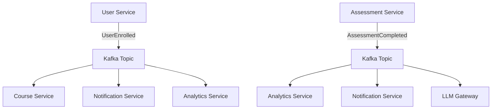

# LMS Microservices Architecture

## 🎯 **Executive Summary**

This document outlines a comprehensive **self-hosted Learning Management System (LMS)** built using **microservices architecture**, **Domain-Driven Design (DDD)**, and **Event-Driven Architecture (EDA)** principles. The system is designed for deployment on a VPS without cloud dependencies, emphasizing scalability, maintainability, and operational excellence.

---

## 🗂️ **Monorepo Structure**

```text
lms/
├── services/
│   ├── api-gateway/
│   │   ├── src/
│   │   │   ├── routes/
│   │   │   ├── plugins/
│   │   │   ├── middleware/
│   │   │   │   ├── auth.ts
│   │   │   │   ├── rate-limit.ts
│   │   │   │   └── circuit-breaker.ts
│   │   │   └── main.ts
│   │   ├── openapi/
│   │   │   └── gateway.yaml
│   │   ├── Dockerfile
│   │   └── package.json
│
│   ├── auth-service/                    # 🆕 NEW SERVICE
│   │   ├── src/
│   │   │   ├── routes/
│   │   │   ├── services/
│   │   │   │   ├── jwt.service.ts
│   │   │   │   ├── oauth.service.ts
│   │   │   │   └── session.service.ts
│   │   │   ├── models/
│   │   │   └── main.ts
│   │   ├── openapi/
│   │   │   └── auth.yaml
│   │   ├── Dockerfile
│   │   └── package.json
│
│   ├── user-service/
│   │   ├── src/
│   │   │   ├── routes/
│   │   │   ├── models/
│   │   │   ├── controllers/
│   │   │   ├── services/
│   │   │   ├── events/                  # 🆕 Event handlers
│   │   │   │   ├── handlers/
│   │   │   │   └── publishers/
│   │   │   └── main.ts
│   │   ├── openapi/
│   │   │   └── user.yaml
│   │   ├── Dockerfile
│   │   └── package.json
│
│   ├── course-service/
│   │   ├── src/
│   │   │   ├── routes/
│   │   │   ├── models/
│   │   │   ├── services/
│   │   │   ├── events/
│   │   │   │   ├── handlers/
│   │   │   │   └── publishers/
│   │   │   └── main.ts
│   │   ├── openapi/
│   │   │   └── course.yaml
│   │   ├── Dockerfile
│   │   └── package.json
│
│   ├── file-service/                    # 🆕 NEW SERVICE
│   │   ├── src/
│   │   │   ├── routes/
│   │   │   ├── storage/
│   │   │   │   ├── local.storage.ts
│   │   │   │   └── s3-compatible.storage.ts
│   │   │   ├── processors/
│   │   │   │   ├── image.processor.ts
│   │   │   │   └── video.processor.ts
│   │   │   └── main.ts
│   │   ├── openapi/
│   │   │   └── file.yaml
│   │   ├── Dockerfile
│   │   └── package.json
│
│
│   ├── search-service/                  # 🆕 NEW SERVICE
│   │   ├── src/
│   │   │   ├── routes/
│   │   │   ├── indexers/
│   │   │   ├── search-engines/
│   │   │   │   ├── elasticsearch.engine.ts
│   │   │   │   └── local.engine.ts
│   │   │   └── main.ts
│   │   ├── openapi/
│   │   │   └── search.yaml
│   │   ├── Dockerfile
│   │   └── package.json
│
│   ├── notification-service/
│   │   ├── src/
│   │   │   ├── workers/
│   │   │   ├── strategies/
│   │   │   │   ├── email.strategy.ts
│   │   │   │   ├── sms.strategy.ts
│   │   │   │   └── push.strategy.ts
│   │   │   ├── templates/
│   │   │   └── main.ts
│   │   ├── Dockerfile
│   │   └── package.json
│
│   ├── content-ingestion-service/
│   │   ├── src/
│   │   │   ├── workers/
│   │   │   ├── scrapers/
│   │   │   ├── adapters/
│   │   │   │   ├── youtube.adapter.ts
│   │   │   │   ├── github.adapter.ts
│   │   │   │   └── scorm.adapter.ts
│   │   │   └── main.ts
│   │   ├── Dockerfile
│   │   └── package.json
│
│   ├── llm-gateway/
│   │   ├── src/
│   │   │   ├── routes/
│   │   │   ├── services/
│   │   │   ├── queue/
│   │   │   ├── rate-limiters/
│   │   │   └── main.ts
│   │   ├── openapi/
│   │   │   └── llm-gateway.yaml
│   │   ├── Dockerfile
│   │   └── package.json
│
│   ├── llm-worker/
│   │   ├── src/
│   │   │   ├── consumers/
│   │   │   ├── processors/
│   │   │   ├── fallback/
│   │   │   └── main.ts
│   │   ├── Dockerfile
│   │   └── package.json
│
│   ├── analytics-service/
│   │   ├── src/
│   │   │   ├── routes/
│   │   │   ├── models/
│   │   │   ├── services/
│   │   │   ├── events/
│   │   │   │   ├── handlers/
│   │   │   │   └── publishers/
│   │   │   └── main.ts
│   │   ├── openapi/
│   │   │   └── analytics.yaml
│   │   ├── Dockerfile
│   │   └── package.json
│
├── libs/                                # 🆕 Shared Libraries
│   ├── shared-auth/
│   │   ├── src/
│   │   │   ├── jwt.ts
│   │   │   ├── rbac.ts
│   │   │   └── middleware.ts
│   │   └── package.json
│   ├── shared-events/
│   │   ├── src/
│   │   │   ├── kafka-client.ts
│   │   │   ├── event-bus.ts
│   │   │   └── schemas/
│   │   └── package.json
│   ├── shared-db/
│   │   ├── src/
│   │   │   ├── connection.ts
│   │   │   ├── migrations/
│   │   │   └── utils.ts
│   │   └── package.json
│   └── shared-utils/
│       ├── src/
│       │   ├── logger.ts
│       │   ├── metrics.ts
│       │   ├── health.ts
│       │   └── validation.ts
│       └── package.json
│
├── infra/
│   ├── docker-compose.yml
│   ├── docker-compose.dev.yml          # 🆕 Development override
│   ├── docker-compose.prod.yml         # 🆕 Production override
│   ├── nginx/
│   │   ├── nginx.conf
│   │   ├── ssl/                        # 🆕 SSL certificates
│   │   └── rate-limits.conf            # 🆕 Rate limiting config
│   ├── kafka/
│   │   ├── docker-compose.override.yml
│   │   └── topics.sh                   # 🆕 Topic creation script
│   ├── postgres/
│   │   ├── init.sql
│   │   ├── schemas/                    # 🆕 Service-specific schemas
│   │   └── migrations/
│   ├── redis/
│   │   ├── redis.conf
│   │   └── cluster.conf                # 🆕 Redis cluster config
│   ├── elasticsearch/                  # 🆕 Search infrastructure
│   │   ├── elasticsearch.yml
│   │   └── mappings/
│   ├── prometheus/
│   │   ├── prometheus.yml
│   │   └── rules/
│   │       ├── alert.rules.yml
│   │       └── recording.rules.yml     # 🆕 Recording rules
│   ├── grafana/                        # 🆕 Grafana dashboards
│   │   ├── dashboards/
│   │   └── provisioning/
│   ├── jaeger/                         # 🆕 Distributed tracing
│   │   └── jaeger.yml
│   └── backup/                         # 🆕 Backup scripts
│       ├── postgres-backup.sh
│       └── restore.sh
│
├── scripts/
│   ├── setup.sh                        # 🆕 Environment setup
│   ├── health-check.sh
│   ├── deploy.sh                       # 🆕 Deployment script
│   └── migrate.sh                      # 🆕 Database migrations
│
├── docs/                               # 🆕 Documentation
│   ├── api/                           # OpenAPI specs
│   ├── deployment/
│   ├── development/
│   └── architecture/
│
├── .env
├── .env.example                        # 🆕 Environment template
├── .dockerignore
├── .gitignore
├── README.md
├── Makefile
└── docker-compose.override.yml.example # 🆕 Local development template
```

---

## 🏗️ **Service Architecture & Responsibilities**

### **Core Services**

#### 1. **API Gateway**
**Purpose:** Single entry point for all client traffic
**Responsibilities:**
- Route requests to backend services
- Authentication & authorization validation
- Rate limiting and throttling
- Request/response transformation
- Circuit breaker pattern implementation
- API versioning and backward compatibility
- CORS handling and security headers

**Technology:** Node.js + Fastify + OpenAPI
**Patterns:** Gateway Aggregation, Backend for Frontend (BFF)

#### 2. **Auth Service** 🆕
**Purpose:** Centralized authentication and authorization
**Responsibilities:**
- JWT token issuance and validation
- OAuth2/OIDC integration
- Session management
- Password policies and security
- Multi-factor authentication (MFA)
- Service-to-service authentication

**Technology:** Node.js + Fastify + Redis (sessions)
**Patterns:** Token-based authentication, RBAC

#### 3. **User Service**
**Purpose:** User identity and profile management
**Responsibilities:**
- User CRUD operations
- Profile management
- Role and permission assignment
- Enrollment tracking
- User preferences and settings
- Account lifecycle management

**Technology:** Node.js + Fastify + PostgreSQL
**Events:** `UserCreated`, `UserUpdated`, `UserEnrolled`, `UserDeactivated`

#### 4. **Course Service**
**Purpose:** Learning content and course management
**Responsibilities:**
- Course CRUD operations
- Module and lesson hierarchy
- Content publishing workflow
- Course metadata and categorization
- Prerequisites and dependencies
- Instructor assignment

**Technology:** Node.js + Fastify + PostgreSQL
**Events:** `CourseCreated`, `CoursePublished`, `ModuleAdded`, `ContentUpdated`

#### 5. **File Service** 🆕
**Purpose:** Media and document management
**Responsibilities:**
- File upload and storage
- Image/video processing and optimization
- CDN integration (optional)
- File versioning and metadata
- Access control and permissions
- Virus scanning and validation

**Technology:** Node.js + Fastify + Local Storage/MinIO
**Patterns:** Storage abstraction, Content delivery optimization


### **Supporting Services**

#### 8. **Search Service** 🆕
**Purpose:** Content discovery and search functionality
**Responsibilities:**
- Full-text search across courses and content
- Search indexing and optimization
- Faceted search and filtering
- Search analytics and recommendations
- Auto-complete and suggestions

**Technology:** Node.js + Fastify + Elasticsearch/OpenSearch
**Patterns:** CQRS (read-optimized), Event-driven indexing

#### 9. **Notification Service**
**Purpose:** Multi-channel messaging and alerts
**Responsibilities:**
- Email, SMS, and push notifications
- Notification templates and personalization
- Delivery tracking and retry logic
- User preference management
- Bulk messaging and campaigns

**Technology:** Node.js + Fastify + Redis Queue (BullMQ)
**Patterns:** Strategy Pattern (delivery channels), Event-driven consumers

#### 10. **Analytics Service**
**Purpose:** Learning analytics and reporting
**Responsibilities:**
- Real-time dashboard data
- Learning progress tracking
- Performance metrics and KPIs
- Custom report generation
- Data aggregation and materialized views

**Technology:** Node.js + Fastify + TypeScript + PostgreSQL + ClickHouse (optional)
**Patterns:** CQRS (read models), Event Sourcing projections

#### 11. **Content Ingestion Service**
**Purpose:** Third-party content integration
**Responsibilities:**
- Provide content to ingest (eg. description, title and transcript of video uploaded)
- Content normalization and mapping
- Metadata extraction and validation
- Scheduled content synchronization
- Content format conversion
- Embed the content in the vector database
- Call the LLM Gateway to generate the embedding

**Technology:** Node.js + Background workers + Redis Queue
**Patterns:** Adapter Pattern, ETL Pipeline

#### 12. **LLM Gateway**
**Purpose:** AI/ML request management
**Responsibilities:**
- Prompt queue management
- Request validation and authentication
- Rate limiting and quota management
- Response caching and optimization
- Model selection and routing

**Technology:** Node.js + Fastify + Redis Queue
**Patterns:** Gateway Pattern, Queue-based processing

#### 13. **LLM Worker**
**Purpose:** AI model execution backend
**Responsibilities:**
- Ollama integration and management
- Prompt processing and response generation
- Model loading and optimization
- Fallback and error handling
- Response post-processing

**Technology:** Node.js + Ollama + GPU optimization
**Patterns:** Worker Pattern, Circuit Breaker

---

## 🔄 **Event-Driven Architecture**

### **Event Categories**

#### **Domain Events**
- `UserCreated`, `UserEnrolled`, `CoursePublished`
- `AssessmentSubmitted`, `ModuleCompleted`
- `FileUploaded`, `SearchPerformed`

#### **Integration Events**
- `NotificationRequested`, `AnalyticsDataUpdated`
- `ContentIngestionCompleted`, `LLMProcessingRequested`

#### **System Events**
- `ServiceHealthChanged`
- `BackupCompleted`

### **Event Flow Patterns**



### **Saga Orchestration** 🆕

**User Enrollment Saga:**
1. Validate user eligibility
2. Check course capacity
3. Process payment (if applicable)
4. Create enrollment record
5. Send welcome notification
6. Update analytics

**Assessment Completion Saga:**
1. Validate submission
2. Calculate score
3. Update progress tracking
4. Generate certificate (if applicable)
5. Send completion notification
6. Trigger next module unlock

---

## 🛡️ **Security Architecture**

### **Authentication & Authorization**
- **JWT-based authentication** with refresh tokens
- **Role-Based Access Control (RBAC)** with fine-grained permissions
- **Service-to-service authentication** using mTLS or API keys
- **OAuth2/OIDC integration** for external identity providers

### **Data Protection**
- **Encryption at rest** for sensitive data (AES-256)
- **TLS 1.3** for all service communication
- **API rate limiting** and DDoS protection
- **Input validation** and SQL injection prevention
- **CORS policies** and security headers

### **Compliance**
- **GDPR compliance** with data portability and deletion
- **FERPA compliance** for educational records
- **Data retention policies** and automated cleanup

---

## 🏗️ **Infrastructure Architecture**

### **Core Infrastructure**

#### **Message Broker**
- **Apache Kafka** for event streaming
- **Topic partitioning** for scalability
- **Consumer groups** for load distribution
- **Schema registry** for event versioning

#### **Databases**
- **PostgreSQL** as primary database
- **Service-specific schemas** with shared connection pooling
- **Read replicas** for analytics queries
- **Automated backups** and point-in-time recovery

#### **Caching & Queues**
- **Redis Cluster** for caching and sessions
- **BullMQ** for background job processing
- **Cache-aside pattern** for performance optimization

#### **Search & Analytics**
- **Elasticsearch/OpenSearch** for full-text search
- **ClickHouse** (optional) for analytics workloads
- **Real-time indexing** via event streams

### **Observability Stack**

#### **Monitoring**
- **Prometheus** for metrics collection
- **Grafana** for visualization and alerting
- **Custom dashboards** per service
- **SLA/SLO monitoring** and alerting

#### **Logging**
- **Structured logging** (JSON format)
- **Centralized log aggregation** (ELK stack optional)
- **Log correlation** with trace IDs
- **Log retention policies**

#### **Tracing**
- **Jaeger** for distributed tracing
- **OpenTelemetry** instrumentation
- **Request flow visualization**
- **Performance bottleneck identification**

### **Deployment & Operations**

#### **Containerization**
- **Docker** containers for all services
- **Multi-stage builds** for optimization
- **Health checks** and graceful shutdowns
- **Resource limits** and requests

#### **Orchestration**
- **Docker Compose** for local development
- **Production deployment** on VPS
- **Service discovery** and load balancing
- **Rolling updates** and rollback strategies

#### **Backup & Recovery**
- **Automated database backups**
- **Disaster recovery procedures**
- **RTO/RPO targets** definition

---

## 🚀 **Deployment Strategy**

### **Environment Management**
- **Development:** Local Docker Compose
- **Staging:** VPS with production-like setup
- **Production:** VPS with high availability configuration

### **CI/CD Pipeline**
1. **Code commit** triggers automated tests
2. **Docker image building** and security scanning
3. **Staging deployment** and integration tests
4. **Production deployment** with blue-green strategy
5. **Health checks** and rollback procedures

### **Scaling Strategy**
- **Horizontal scaling** for stateless services
- **Database read replicas** for read-heavy workloads
- **CDN integration** for static content delivery
- **Load balancing** with NGINX or HAProxy

---

## 📊 **Performance & Scalability**

### **Performance Targets**
- **API Response Time:** < 200ms (95th percentile)
- **Database Query Time:** < 100ms (average)
- **Event Processing Latency:** < 1 second
- **File Upload Speed:** > 10MB/s

### **Scalability Patterns**
- **Database sharding** for large datasets
- **CQRS** for read/write separation
- **Microservice decomposition** for team autonomy

### **Caching Strategy**
- **Application-level caching** with Redis
- **Database query result caching**
- **CDN caching** for static assets
- **API response caching** with TTL

---

## 🔧 **Development Guidelines**

### **Code Standards**
- **TypeScript** for Node.js services
- **OpenAPI 3.0** for API documentation
- **Unit test coverage** > 80%
- **Integration tests** for critical paths

### **Service Communication**
- **REST APIs** for synchronous communication
- **Event-driven** for asynchronous communication
- **gRPC** for high-performance internal communication (optional)
- **GraphQL** for complex client queries (optional)

### **Error Handling**
- **Structured error responses** with error codes
- **Circuit breaker pattern** for external dependencies
- **Retry logic** with exponential backoff
- **Graceful degradation** for non-critical features

---

## 🎯 **Implementation Phases**

### **Phase 1: Foundation (MVP)**
**Duration:** 8-10 weeks
**Services:**
- API Gateway + Auth Service
- User Service + Course Service
- File Service + Basic Notification Service
- Core infrastructure (Kafka, Redis, PostgreSQL)

**Deliverables:**
- User registration and authentication
- Basic course creation and enrollment
- File upload and management
- Email notifications

### **Phase 2: Learning Features**
**Duration:** 6-8 weeks
**Services:**
- Assessment Authoring + Execution Services
- Search Service
- Enhanced Notification Service
- Analytics Service (basic)

**Deliverables:**
- Quiz creation and taking
- Course search and discovery
- Multi-channel notifications
- Basic learning analytics

### **Phase 3: Intelligence & Advanced Features**
**Duration:** 8-10 weeks
**Services:**
- LLM Gateway + Worker
- Content Ingestion Service
- Advanced Analytics Service

**Deliverables:**
- AI-powered content recommendations
- Third-party content integration
- Advanced analytics and reporting

### **Phase 4: Production Readiness**
**Duration:** 4-6 weeks
**Focus:**
- Performance optimization
- Security hardening
- Monitoring and alerting
- Documentation and training

**Deliverables:**
- Production deployment
- Monitoring dashboards
- Operational procedures
- User documentation

---

## 🤔 **Key Decisions & Trade-offs**

### **Technology Choices**
- **Node.js + Fastify:** Fast development, good ecosystem, TypeScript support
- **PostgreSQL:** ACID compliance, JSON support, mature ecosystem
- **Kafka:** High throughput, durability, event replay capabilities

### **Architectural Trade-offs**
- **Microservices complexity** vs. **development velocity**
- **Event-driven consistency** vs. **immediate consistency**
- **Service autonomy** vs. **data consistency**
- **Self-hosted deployment** vs. **cloud-native features**

### **Operational Considerations**
- **Single VPS deployment** limits horizontal scaling initially
- **Event-driven architecture** requires careful error handling
- **Multiple databases** increase operational complexity
- **Service mesh** may be needed for production scale

---

## 📋 **Next Steps & Recommendations**

### **Immediate Actions**
1. **Validate requirements** with stakeholders
2. **Set up development environment** and tooling
3. **Create service templates** and shared libraries
4. **Implement Phase 1 services** incrementally
5. **Establish CI/CD pipeline** early

### **Future Considerations**
- **Multi-tenancy** for SaaS deployment
- **Mobile app** development strategy
- **Offline learning** capabilities
- **Advanced AI features** (personalization, adaptive learning)
- **Integration marketplace** for third-party tools

### **Risk Mitigation**
- **Start with monolith** and extract services gradually
- **Implement feature flags** for safe deployments
- **Create comprehensive testing strategy**
- **Plan for data migration** and service evolution
- **Establish monitoring** and alerting from day one

---

This architecture provides a solid foundation for a scalable, maintainable LMS while remaining deployable on a single VPS. The phased approach allows for iterative development and validation of architectural decisions.
