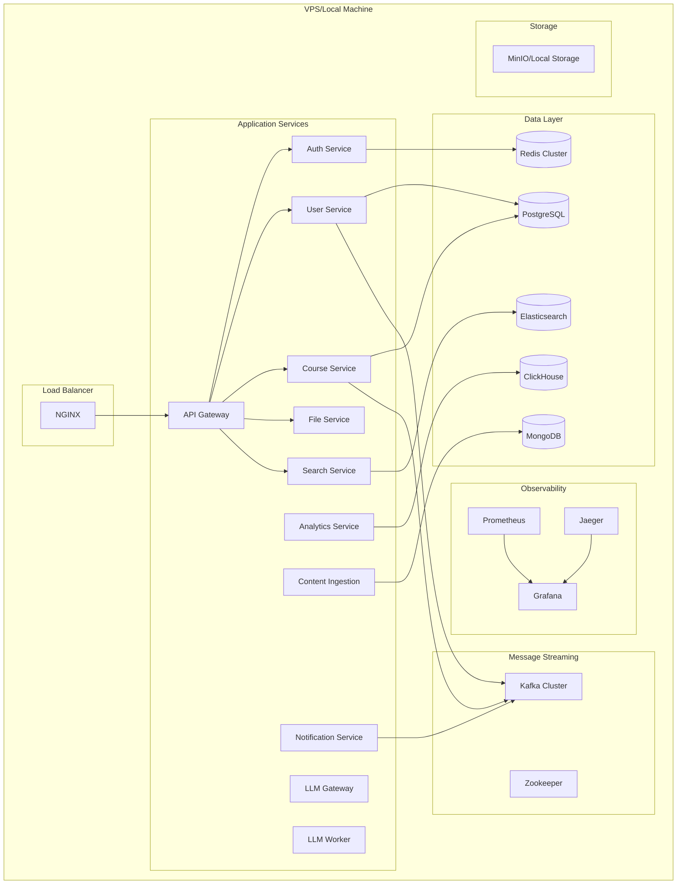

# LMS Infrastructure Specification

## 🎯 **Executive Summary**

This document provides a comprehensive infrastructure specification for the LMS microservices system. The infrastructure is designed to run on a single VPS in production with Docker Compose orchestration, supporting 13 microservices with multiple database technologies, event streaming, and full observability stack.

## 📋 **Table of Contents**

1. [Infrastructure Overview](#infrastructure-overview)
2. [Core Infrastructure Components](#core-infrastructure-components)
3. [Database Architecture](#database-architecture)
4. [Message Streaming & Queues](#message-streaming--queues)
5. [Observability Stack](#observability-stack)
6. [Security & Networking](#security--networking)
7. [Storage & File Management](#storage--file-management)
8. [Load Balancing & Reverse Proxy](#load-balancing--reverse-proxy)
9. [Environment Configuration](#environment-configuration)
10. [Resource Allocation](#resource-allocation)
11. [Backup & Recovery](#backup--recovery)
12. [Monitoring & Alerting](#monitoring--alerting)
13. [Deployment Strategy](#deployment-strategy)
14. [Operational Procedures](#operational-procedures)

---

## 🏗️ **Infrastructure Overview**

### **Deployment Architecture**



### **Technology Stack Summary**

| Component | Technology | Purpose | Replicas |
|-----------|------------|---------|----------|
| **Reverse Proxy** | NGINX | Load balancing, SSL termination | 1 |
| **API Gateway** | Node.js + Fastify | Request routing, auth validation | 2 |
| **Databases** | PostgreSQL, Redis, Elasticsearch, ClickHouse, MongoDB | Data persistence | 1-3 each |
| **Message Broker** | Apache Kafka + Zookeeper | Event streaming | 3 brokers |
| **Monitoring** | Prometheus + Grafana + Jaeger | Observability | 1 each |
| **Storage** | MinIO/Local FS | File storage | 1 |

---
## 🔧 **Core Infrastructure Components**

### **Container Orchestration**

#### **Docker Compose Configuration**
- **Base Configuration:** `docker-compose.yml` - Core services and infrastructure
- **Development Override:** `docker-compose.dev.yml` - Development-specific settings
- **Production Override:** `docker-compose.prod.yml` - Production optimizations
- **Local Override:** `docker-compose.override.yml` - Personal development settings

#### **Service Discovery & Networking**
- **Internal Network:** Custom bridge network `lms-network`
- **Service Communication:** DNS-based service discovery via Docker Compose
- **Port Allocation:** Standardized port ranges per service type
- **Health Checks:** Built-in Docker health checks for all services

### **Resource Management**

#### **CPU & Memory Allocation**
```yaml
# Example resource limits
services:
  api-gateway:
    deploy:
      resources:
        limits:
          cpus: '1.0'
          memory: 512M
        reservations:
          cpus: '0.5'
          memory: 256M
  
  postgresql:
    deploy:
      resources:
        limits:
          cpus: '2.0'
          memory: 2G
        reservations:
          cpus: '1.0'
          memory: 1G
```

#### **Storage Volumes**
- **Database Volumes:** Persistent named volumes for all databases
- **Log Volumes:** Centralized logging directory mounts
- **Config Volumes:** Configuration file mounts
- **Backup Volumes:** Dedicated backup storage

---

## 🗄️ **Database Architecture**

### **PostgreSQL - Primary Database**

#### **Configuration**
- **Version:** PostgreSQL 15+
- **Deployment:** Single instance with planned read replica
- **Storage:** Persistent volume with 100GB initial allocation
- **Connection Pooling:** PgBouncer for connection management
- **Backup:** Automated daily backups with 30-day retention

#### **Database Schema Organization**
```sql
-- Service-specific schemas
CREATE SCHEMA user_service;
CREATE SCHEMA course_service;
CREATE SCHEMA auth_service;
CREATE SCHEMA analytics_service;
CREATE SCHEMA file_service;

-- Shared schemas
CREATE SCHEMA shared_events;
CREATE SCHEMA shared_audit;
```

#### **Performance Tuning**
```postgresql
# postgresql.conf optimizations
shared_buffers = 512MB
effective_cache_size = 1GB
work_mem = 16MB
maintenance_work_mem = 256MB
max_connections = 200
```

### **Redis Cluster - Caching & Sessions**

#### **Configuration**
- **Deployment:** 3-node cluster (1 master, 2 replicas)
- **Memory:** 1GB per node
- **Persistence:** RDB + AOF for durability
- **Use Cases:** Session storage, caching, rate limiting, queues

#### **Redis Instance Allocation**
```yaml
redis-master:
  image: redis:7-alpine
  command: redis-server --appendonly yes --cluster-enabled yes
  
redis-replica-1:
  image: redis:7-alpine
  command: redis-server --appendonly yes --slaveof redis-master 6379
  
redis-replica-2:
  image: redis:7-alpine
  command: redis-server --appendonly yes --slaveof redis-master 6379
```

### **Elasticsearch - Search Engine**

#### **Configuration**
- **Version:** Elasticsearch 8.x
- **Deployment:** Single node (development), 3-node cluster (production)
- **Memory:** 2GB heap size
- **Storage:** 50GB persistent volume
- **Use Cases:** Full-text search, content indexing, log aggregation

#### **Index Management**
```json
{
  "courses": {
    "mappings": {
      "properties": {
        "title": {"type": "text", "analyzer": "standard"},
        "description": {"type": "text", "analyzer": "standard"},
        "tags": {"type": "keyword"},
        "created_at": {"type": "date"}
      }
    }
  }
}
```

### **ClickHouse - Analytics Database**

#### **Configuration**
- **Version:** ClickHouse 23.x
- **Deployment:** Single instance
- **Memory:** 1GB
- **Storage:** 30GB persistent volume
- **Use Cases:** Time-series analytics, aggregated reporting, metrics storage

#### **Table Structure**
```sql
CREATE TABLE analytics.user_events (
    event_time DateTime,
    user_id UInt64,
    event_type String,
    properties String,
    session_id String
) ENGINE = MergeTree()
ORDER BY (event_time, user_id);
```

### **MongoDB - Document Storage**

#### **Configuration**
- **Version:** MongoDB 6.x
- **Deployment:** Single instance with replica set
- **Memory:** 512MB
- **Storage:** 20GB persistent volume
- **Use Cases:** Content ingestion metadata, flexible document storage

#### **Collections**
```javascript
// Content ingestion documents
db.content_sources.createIndex({"source_type": 1, "created_at": -1});
db.ingestion_jobs.createIndex({"status": 1, "scheduled_at": 1});
```

---
## 📨 **Message Streaming & Queues**

### **Apache Kafka - Event Streaming**

#### **Cluster Configuration**
- **Brokers:** 3 Kafka brokers for high availability
- **Zookeeper:** 3-node Zookeeper ensemble
- **Replication Factor:** 3 for production, 1 for development
- **Partitions:** 6 partitions per topic (default)

#### **Topic Structure**
```bash
# Core domain events
user-events          # UserCreated, UserUpdated, UserEnrolled
course-events        # CourseCreated, CoursePublished, ModuleAdded
assessment-events    # AssessmentSubmitted, AssessmentCompleted
file-events          # FileUploaded, FileProcessed

# Integration events
notification-requests # NotificationRequested
analytics-events     # AnalyticsDataUpdated
llm-requests         # LLMProcessingRequested
content-ingestion    # ContentIngestionCompleted

# System events
service-health       # ServiceHealthChanged
audit-events         # AuditLogCreated
```

#### **Kafka Configuration**
```properties
# server.properties
num.network.threads=8
num.io.threads=16
socket.send.buffer.bytes=102400
socket.receive.buffer.bytes=102400
socket.request.max.bytes=104857600
log.retention.hours=168
log.segment.bytes=1073741824
log.retention.check.interval.ms=300000
```

### **Redis Queues - Background Jobs**

#### **Queue Types**
- **High Priority:** Authentication, critical notifications
- **Medium Priority:** File processing, search indexing
- **Low Priority:** Analytics processing, batch operations
- **Scheduled Jobs:** Backup tasks, cleanup operations

#### **BullMQ Configuration**
```typescript
// Queue configuration
const queueConfig = {
  connection: {
    host: 'redis-master',
    port: 6379,
    db: 1
  },
  defaultJobOptions: {
    removeOnComplete: 100,
    removeOnFail: 50,
    attempts: 3,
    backoff: {
      type: 'exponential',
      delay: 2000
    }
  }
};
```

---

## 📊 **Observability Stack**

### **Prometheus - Metrics Collection**

#### **Configuration**
- **Scrape Interval:** 15 seconds
- **Retention:** 30 days
- **Storage:** 10GB persistent volume
- **Targets:** All services + infrastructure components

#### **Metrics Collection**
```yaml
# prometheus.yml
global:
  scrape_interval: 15s
  evaluation_interval: 15s

scrape_configs:
  - job_name: 'api-gateway'
    static_configs:
      - targets: ['api-gateway:3000']
    metrics_path: '/metrics'
    
  - job_name: 'user-service'
    static_configs:
      - targets: ['user-service:3001']
    
  - job_name: 'postgresql'
    static_configs:
      - targets: ['postgres-exporter:9187']
    
  - job_name: 'redis'
    static_configs:
      - targets: ['redis-exporter:9121']
```

#### **Custom Metrics**
```typescript
// Application metrics
const httpRequestDuration = new prometheus.Histogram({
  name: 'http_request_duration_seconds',
  help: 'Duration of HTTP requests in seconds',
  labelNames: ['method', 'route', 'status_code']
});

const activeUsers = new prometheus.Gauge({
  name: 'active_users_total',
  help: 'Number of currently active users'
});
```

### **Grafana - Visualization & Alerting**

#### **Dashboard Categories**
- **Infrastructure Overview:** System resources, database performance
- **Application Metrics:** Service-specific dashboards
- **Business Metrics:** User engagement, course completion rates
- **SLA/SLO Monitoring:** Availability, response times, error rates

#### **Alert Rules**
```yaml
# alert.rules.yml
groups:
  - name: infrastructure
    rules:
      - alert: HighMemoryUsage
        expr: (node_memory_MemTotal_bytes - node_memory_MemAvailable_bytes) / node_memory_MemTotal_bytes > 0.85
        for: 5m
        labels:
          severity: warning
        annotations:
          summary: "High memory usage detected"
          
      - alert: ServiceDown
        expr: up == 0
        for: 1m
        labels:
          severity: critical
        annotations:
          summary: "Service {{ $labels.instance }} is down"
```

### **Jaeger - Distributed Tracing**

#### **Configuration**
- **Deployment:** All-in-one Jaeger instance
- **Storage:** Elasticsearch backend
- **Sampling:** 10% for production, 100% for development
- **Retention:** 7 days

#### **Trace Collection**
```typescript
// OpenTelemetry configuration
const tracer = trace.getTracer('lms-service', '1.0.0');

// Automatic instrumentation
const { NodeSDK } = require('@opentelemetry/sdk-node');
const { getNodeAutoInstrumentations } = require('@opentelemetry/auto-instrumentations-node');

const sdk = new NodeSDK({
  traceExporter: new JaegerExporter({
    endpoint: 'http://jaeger:14268/api/traces',
  }),
  instrumentations: [getNodeAutoInstrumentations()]
});
```

### **Logging Strategy**

#### **Log Aggregation**
- **Format:** Structured JSON logging
- **Centralization:** Docker log drivers + optional ELK stack
- **Retention:** 30 days for application logs, 7 days for debug logs
- **Correlation:** Trace ID injection for request correlation

#### **Log Levels & Categories**
```typescript
// Structured logging example
const logger = winston.createLogger({
  format: winston.format.combine(
    winston.format.timestamp(),
    winston.format.errors({ stack: true }),
    winston.format.json()
  ),
  defaultMeta: {
    service: 'user-service',
    version: '1.0.0'
  }
});

// Usage
logger.info('User created', {
  userId: user.id,
  email: user.email,
  traceId: req.traceId
});
```

---
## 🛡️ **Security & Networking**

### **Network Architecture**

#### **Docker Networks**
```yaml
networks:
  lms-network:
    driver: bridge
    ipam:
      config:
        - subnet: 172.20.0.0/16
  
  lms-internal:
    driver: bridge
    internal: true  # No external access
    ipam:
      config:
        - subnet: 172.21.0.0/16
```

#### **Service Network Segmentation**
- **Public Network:** API Gateway, NGINX (external access)
- **Application Network:** All microservices (internal communication)
- **Data Network:** Databases, message brokers (restricted access)
- **Monitoring Network:** Observability stack (internal only)

### **SSL/TLS Configuration**

#### **Certificate Management**
- **Development:** Self-signed certificates
- **Production:** Let's Encrypt certificates with auto-renewal
- **Internal Communication:** mTLS for service-to-service (optional)

#### **NGINX SSL Configuration**
```nginx
server {
    listen 443 ssl http2;
    server_name lms.example.com;
    
    ssl_certificate /etc/ssl/certs/lms.crt;
    ssl_certificate_key /etc/ssl/private/lms.key;
    ssl_protocols TLSv1.2 TLSv1.3;
    ssl_ciphers ECDHE-RSA-AES256-GCM-SHA512:DHE-RSA-AES256-GCM-SHA512;
    ssl_prefer_server_ciphers off;
    
    # Security headers
    add_header Strict-Transport-Security "max-age=63072000" always;
    add_header X-Frame-Options DENY;
    add_header X-Content-Type-Options nosniff;
}
```

### **Authentication & Authorization**

#### **Service-to-Service Authentication**
```yaml
# API Gateway authentication middleware
auth_service_config:
  jwt_secret: ${JWT_SECRET}
  jwt_expiry: 3600
  refresh_token_expiry: 604800
  
service_auth:
  api_keys:
    user_service: ${USER_SERVICE_API_KEY}
    course_service: ${COURSE_SERVICE_API_KEY}
    notification_service: ${NOTIFICATION_SERVICE_API_KEY}
```

### **Firewall & Access Control**

#### **Port Exposure Strategy**
```yaml
# Only expose necessary ports
services:
  nginx:
    ports:
      - "80:80"
      - "443:443"
  
  # Internal services - no external ports
  api-gateway:
    expose:
      - "3000"
  
  # Monitoring - restricted access
  grafana:
    ports:
      - "127.0.0.1:3001:3000"  # Localhost only
```

---

## 💾 **Storage & File Management**

### **File Storage Strategy**

#### **MinIO Configuration**
```yaml
minio:
  image: minio/minio:latest
  command: server /data --console-address ":9001"
  environment:
    MINIO_ROOT_USER: ${MINIO_ACCESS_KEY}
    MINIO_ROOT_PASSWORD: ${MINIO_SECRET_KEY}
  volumes:
    - minio_data:/data
  ports:
    - "9000:9000"
    - "9001:9001"
```

#### **Bucket Organization**
```bash
# MinIO bucket structure
lms-files/
├── user-avatars/
├── course-materials/
│   ├── videos/
│   ├── documents/
│   └── images/
├── assignments/
├── certificates/
└── temp-uploads/
```

### **Local File System (Alternative)**
```yaml
# Local storage volumes
volumes:
  file_storage:
    driver: local
    driver_opts:
      type: none
      o: bind
      device: /opt/lms/storage
```

### **File Processing Pipeline**
```typescript
// File processing workflow
const fileProcessingQueue = new Queue('file-processing', {
  connection: redisConnection
});

// Image processing
fileProcessingQueue.add('process-image', {
  fileId: 'uuid',
  operations: ['resize', 'optimize', 'thumbnail']
});

// Video processing
fileProcessingQueue.add('process-video', {
  fileId: 'uuid',
  operations: ['transcode', 'thumbnail', 'metadata']
});
```

---

## ⚖️ **Load Balancing & Reverse Proxy**

### **NGINX Configuration**

#### **Main Configuration**
```nginx
# nginx.conf
upstream api_gateway {
    least_conn;
    server api-gateway-1:3000 max_fails=3 fail_timeout=30s;
    server api-gateway-2:3000 max_fails=3 fail_timeout=30s;
}

upstream grafana {
    server grafana:3000;
}

server {
    listen 80;
    server_name lms.example.com;
    return 301 https://$server_name$request_uri;
}

server {
    listen 443 ssl http2;
    server_name lms.example.com;
    
    # API routes
    location /api/ {
        proxy_pass http://api_gateway;
        proxy_set_header Host $host;
        proxy_set_header X-Real-IP $remote_addr;
        proxy_set_header X-Forwarded-For $proxy_add_x_forwarded_for;
        proxy_set_header X-Forwarded-Proto $scheme;
        
        # Timeouts
        proxy_connect_timeout 30s;
        proxy_send_timeout 30s;
        proxy_read_timeout 30s;
    }
    
    # File uploads
    location /api/files/upload {
        client_max_body_size 100M;
        proxy_pass http://api_gateway;
        proxy_request_buffering off;
    }
    
    # Monitoring (restricted)
    location /monitoring/ {
        allow 127.0.0.1;
        allow 10.0.0.0/8;
        deny all;
        
        proxy_pass http://grafana/;
    }
}
```

#### **Rate Limiting**
```nginx
# Rate limiting configuration
http {
    limit_req_zone $binary_remote_addr zone=api:10m rate=10r/s;
    limit_req_zone $binary_remote_addr zone=auth:10m rate=5r/s;
    limit_req_zone $binary_remote_addr zone=upload:10m rate=1r/s;
    
    server {
        location /api/auth/ {
            limit_req zone=auth burst=10 nodelay;
            proxy_pass http://api_gateway;
        }
        
        location /api/files/upload {
            limit_req zone=upload burst=3 nodelay;
            proxy_pass http://api_gateway;
        }
        
        location /api/ {
            limit_req zone=api burst=20 nodelay;
            proxy_pass http://api_gateway;
        }
    }
}
```

### **Health Checks & Circuit Breakers**

#### **Service Health Endpoints**
```typescript
// Health check implementation
app.get('/health', async (req, res) => {
  const health = {
    status: 'healthy',
    timestamp: new Date().toISOString(),
    checks: {
      database: await checkDatabase(),
      redis: await checkRedis(),
      kafka: await checkKafka()
    }
  };
  
  const isHealthy = Object.values(health.checks).every(check => check.status === 'healthy');
  res.status(isHealthy ? 200 : 503).json(health);
});
```

---
## ⚙️ **Environment Configuration**

### **Environment Variables Structure**

#### **Core Configuration**
```bash
# .env file structure
# ===================

# Environment
NODE_ENV=production
LOG_LEVEL=info
PORT=3000

# Database Configuration
POSTGRES_HOST=postgresql
POSTGRES_PORT=5432
POSTGRES_DB=lms_db
POSTGRES_USER=lms_user
POSTGRES_PASSWORD=${POSTGRES_PASSWORD}
POSTGRES_MAX_CONNECTIONS=20

# Redis Configuration
REDIS_HOST=redis-master
REDIS_PORT=6379
REDIS_PASSWORD=${REDIS_PASSWORD}
REDIS_DB=0
REDIS_CLUSTER_ENABLED=true

# Kafka Configuration
KAFKA_BROKERS=kafka-1:9092,kafka-2:9092,kafka-3:9092
KAFKA_CLIENT_ID=lms-service
KAFKA_GROUP_ID=lms-consumer-group

# Elasticsearch Configuration
ELASTICSEARCH_HOST=elasticsearch
ELASTICSEARCH_PORT=9200
ELASTICSEARCH_USERNAME=elastic
ELASTICSEARCH_PASSWORD=${ELASTICSEARCH_PASSWORD}

# ClickHouse Configuration
CLICKHOUSE_HOST=clickhouse
CLICKHOUSE_PORT=8123
CLICKHOUSE_DATABASE=analytics
CLICKHOUSE_USERNAME=default
CLICKHOUSE_PASSWORD=${CLICKHOUSE_PASSWORD}

# MongoDB Configuration
MONGODB_HOST=mongodb
MONGODB_PORT=27017
MONGODB_DATABASE=content_db
MONGODB_USERNAME=mongo_user
MONGODB_PASSWORD=${MONGODB_PASSWORD}

# Authentication
JWT_SECRET=${JWT_SECRET}
JWT_EXPIRY=3600
REFRESH_TOKEN_EXPIRY=604800
BCRYPT_ROUNDS=12

# File Storage
STORAGE_TYPE=minio  # or 'local'
MINIO_ENDPOINT=minio:9000
MINIO_ACCESS_KEY=${MINIO_ACCESS_KEY}
MINIO_SECRET_KEY=${MINIO_SECRET_KEY}
MINIO_BUCKET=lms-files

# External Services
SMTP_HOST=${SMTP_HOST}
SMTP_PORT=587
SMTP_USER=${SMTP_USER}
SMTP_PASSWORD=${SMTP_PASSWORD}

# Monitoring
PROMETHEUS_ENDPOINT=http://prometheus:9090
JAEGER_ENDPOINT=http://jaeger:14268/api/traces
GRAFANA_ADMIN_PASSWORD=${GRAFANA_ADMIN_PASSWORD}

# LLM Configuration
OLLAMA_HOST=ollama:11434
LLM_MODEL=llama2
LLM_TEMPERATURE=0.7
LLM_MAX_TOKENS=2048
```

### **Service-Specific Configuration**

#### **API Gateway Environment**
```bash
# API Gateway specific
GATEWAY_PORT=3000
RATE_LIMIT_WINDOW=60000
RATE_LIMIT_MAX_REQUESTS=100
CIRCUIT_BREAKER_THRESHOLD=5
CIRCUIT_BREAKER_TIMEOUT=30000

# Service endpoints
USER_SERVICE_URL=http://user-service:3001
COURSE_SERVICE_URL=http://course-service:3002
AUTH_SERVICE_URL=http://auth-service:3003
FILE_SERVICE_URL=http://file-service:3004
SEARCH_SERVICE_URL=http://search-service:3005
```

#### **Development vs Production Overrides**
```yaml
# docker-compose.dev.yml
version: '3.8'
services:
  api-gateway:
    environment:
      - NODE_ENV=development
      - LOG_LEVEL=debug
      - RATE_LIMIT_MAX_REQUESTS=1000
    volumes:
      - ./services/api-gateway/src:/app/src
    command: npm run dev

# docker-compose.prod.yml
version: '3.8'
services:
  api-gateway:
    environment:
      - NODE_ENV=production
      - LOG_LEVEL=info
    deploy:
      replicas: 2
      resources:
        limits:
          cpus: '1.0'
          memory: 512M
```

---

## 📊 **Resource Allocation**

### **VPS Requirements**

#### **Minimum Production Specifications**
- **CPU:** 8 cores (16 threads)
- **RAM:** 32GB
- **Storage:** 500GB SSD
- **Network:** 1Gbps connection
- **OS:** Ubuntu 22.04 LTS or similar

#### **Development Machine Specifications**
- **CPU:** 6+ cores
- **RAM:** 16GB minimum, 32GB recommended
- **Storage:** 200GB available space
- **Docker:** 20.10+ with Docker Compose v2

### **Service Resource Allocation**

#### **Application Services**
```yaml
# Resource allocation per service
services:
  api-gateway:
    deploy:
      replicas: 2
      resources:
        limits: { cpus: '1.0', memory: '512M' }
        reservations: { cpus: '0.5', memory: '256M' }
  
  auth-service:
    deploy:
      resources:
        limits: { cpus: '0.5', memory: '256M' }
        reservations: { cpus: '0.25', memory: '128M' }
  
  user-service:
    deploy:
      resources:
        limits: { cpus: '1.0', memory: '512M' }
        reservations: { cpus: '0.5', memory: '256M' }
  
  course-service:
    deploy:
      resources:
        limits: { cpus: '1.0', memory: '512M' }
        reservations: { cpus: '0.5', memory: '256M' }
  
  file-service:
    deploy:
      resources:
        limits: { cpus: '1.5', memory: '1G' }
        reservations: { cpus: '0.5', memory: '512M' }
  
  search-service:
    deploy:
      resources:
        limits: { cpus: '1.0', memory: '512M' }
        reservations: { cpus: '0.5', memory: '256M' }
  
  notification-service:
    deploy:
      resources:
        limits: { cpus: '0.5', memory: '256M' }
        reservations: { cpus: '0.25', memory: '128M' }
  
  analytics-service:
    deploy:
      resources:
        limits: { cpus: '1.0', memory: '512M' }
        reservations: { cpus: '0.5', memory: '256M' }
  
  content-ingestion-service:
    deploy:
      resources:
        limits: { cpus: '1.0', memory: '1G' }
        reservations: { cpus: '0.5', memory: '512M' }
  
  llm-gateway:
    deploy:
      resources:
        limits: { cpus: '0.5', memory: '256M' }
        reservations: { cpus: '0.25', memory: '128M' }
  
  llm-worker:
    deploy:
      resources:
        limits: { cpus: '4.0', memory: '4G' }
        reservations: { cpus: '2.0', memory: '2G' }
```

#### **Infrastructure Services**
```yaml
# Database and infrastructure resources
infrastructure:
  postgresql:
    resources:
      limits: { cpus: '2.0', memory: '4G' }
      reservations: { cpus: '1.0', memory: '2G' }
    volumes:
      - postgres_data:/var/lib/postgresql/data
  
  redis-master:
    resources:
      limits: { cpus: '1.0', memory: '1G' }
      reservations: { cpus: '0.5', memory: '512M' }
  
  elasticsearch:
    resources:
      limits: { cpus: '2.0', memory: '3G' }
      reservations: { cpus: '1.0', memory: '2G' }
    environment:
      - "ES_JAVA_OPTS=-Xms1g -Xmx1g"
  
  clickhouse:
    resources:
      limits: { cpus: '1.0', memory: '2G' }
      reservations: { cpus: '0.5', memory: '1G' }
  
  mongodb:
    resources:
      limits: { cpus: '1.0', memory: '1G' }
      reservations: { cpus: '0.5', memory: '512M' }
  
  kafka-broker:
    resources:
      limits: { cpus: '1.0', memory: '1G' }
      reservations: { cpus: '0.5', memory: '512M' }
  
  prometheus:
    resources:
      limits: { cpus: '1.0', memory: '1G' }
      reservations: { cpus: '0.5', memory: '512M' }
  
  grafana:
    resources:
      limits: { cpus: '0.5', memory: '512M' }
      reservations: { cpus: '0.25', memory: '256M' }
```

### **Storage Allocation**

#### **Volume Sizing**
```yaml
volumes:
  # Database storage
  postgres_data:
    driver: local
    driver_opts:
      type: none
      o: bind
      device: /opt/lms/data/postgres  # 100GB allocated
  
  # Search index storage
  elasticsearch_data:
    device: /opt/lms/data/elasticsearch  # 50GB allocated
  
  # Analytics storage
  clickhouse_data:
    device: /opt/lms/data/clickhouse  # 30GB allocated
  
  # Document storage
  mongodb_data:
    device: /opt/lms/data/mongodb  # 20GB allocated
  
  # File storage
  minio_data:
    device: /opt/lms/data/minio  # 200GB allocated
  
  # Monitoring data
  prometheus_data:
    device: /opt/lms/data/prometheus  # 10GB allocated
  
  # Log storage
  log_data:
    device: /opt/lms/logs  # 20GB allocated
  
  # Backup storage
  backup_data:
    device: /opt/lms/backups  # 100GB allocated
```

---
## 🔄 **Backup & Recovery**

### **Backup Strategy**

#### **Database Backups**
```bash
#!/bin/bash
# postgres-backup.sh

BACKUP_DIR="/opt/lms/backups/postgres"
DATE=$(date +%Y%m%d_%H%M%S)
RETENTION_DAYS=30

# Create backup
docker exec postgresql pg_dump -U lms_user -d lms_db > "$BACKUP_DIR/lms_db_$DATE.sql"

# Compress backup
gzip "$BACKUP_DIR/lms_db_$DATE.sql"

# Clean old backups
find "$BACKUP_DIR" -name "*.sql.gz" -mtime +$RETENTION_DAYS -delete

# Upload to remote storage (optional)
# aws s3 cp "$BACKUP_DIR/lms_db_$DATE.sql.gz" s3://lms-backups/postgres/
```

#### **Automated Backup Schedule**
```yaml
# Backup service in docker-compose
backup-service:
  image: alpine:latest
  volumes:
    - ./scripts/backup:/scripts
    - backup_data:/backups
    - postgres_data:/postgres_data:ro
  environment:
    - BACKUP_SCHEDULE=0 2 * * *  # Daily at 2 AM
  command: crond -f
  depends_on:
    - postgresql
    - mongodb
    - elasticsearch
```

#### **Backup Verification**
```bash
#!/bin/bash
# verify-backup.sh

# Test PostgreSQL backup
docker run --rm -v backup_data:/backups postgres:15 \
  psql -U postgres -c "SELECT version();" < /backups/latest/lms_db.sql

# Test MongoDB backup
docker run --rm -v backup_data:/backups mongo:6 \
  mongorestore --dry-run /backups/latest/mongodb/

echo "Backup verification completed"
```

### **Disaster Recovery Procedures**

#### **Recovery Time Objectives (RTO)**
- **Database Recovery:** 30 minutes
- **Full System Recovery:** 2 hours
- **Service Restoration:** 15 minutes per service

#### **Recovery Point Objectives (RPO)**
- **Critical Data:** 1 hour (frequent backups)
- **User Content:** 4 hours (daily backups)
- **Analytics Data:** 24 hours (acceptable loss)

---

## 📈 **Monitoring & Alerting**

### **Key Performance Indicators (KPIs)**

#### **Infrastructure Metrics**
```yaml
# Prometheus recording rules
groups:
  - name: infrastructure.rules
    rules:
      - record: instance:cpu_usage:rate5m
        expr: 100 - (avg by (instance) (irate(node_cpu_seconds_total{mode="idle"}[5m])) * 100)
      
      - record: instance:memory_usage:percentage
        expr: (1 - (node_memory_MemAvailable_bytes / node_memory_MemTotal_bytes)) * 100
      
      - record: instance:disk_usage:percentage
        expr: (1 - (node_filesystem_avail_bytes / node_filesystem_size_bytes)) * 100
```

#### **Application Metrics**
```typescript
// Custom application metrics
const metrics = {
  // Request metrics
  httpRequestsTotal: new Counter({
    name: 'http_requests_total',
    help: 'Total number of HTTP requests',
    labelNames: ['method', 'route', 'status']
  }),
  
  // Response time
  httpRequestDuration: new Histogram({
    name: 'http_request_duration_seconds',
    help: 'HTTP request duration in seconds',
    labelNames: ['method', 'route'],
    buckets: [0.1, 0.3, 0.5, 0.7, 1, 3, 5, 7, 10]
  }),
  
  // Business metrics
  activeUsers: new Gauge({
    name: 'active_users_total',
    help: 'Number of currently active users'
  }),
  
  courseCompletions: new Counter({
    name: 'course_completions_total',
    help: 'Total number of course completions',
    labelNames: ['course_id']
  })
};
```

### **Alert Configuration**

#### **Critical Alerts**
```yaml
# alert.rules.yml
groups:
  - name: critical
    rules:
      - alert: ServiceDown
        expr: up == 0
        for: 1m
        labels:
          severity: critical
        annotations:
          summary: "Service {{ $labels.instance }} is down"
          description: "{{ $labels.instance }} has been down for more than 1 minute"
      
      - alert: HighErrorRate
        expr: rate(http_requests_total{status=~"5.."}[5m]) > 0.1
        for: 2m
        labels:
          severity: critical
        annotations:
          summary: "High error rate detected"
          description: "Error rate is {{ $value }} errors per second"
      
      - alert: DatabaseConnectionFailure
        expr: postgresql_up == 0
        for: 30s
        labels:
          severity: critical
        annotations:
          summary: "Database connection failed"
```

#### **Warning Alerts**
```yaml
  - name: warnings
    rules:
      - alert: HighMemoryUsage
        expr: instance:memory_usage:percentage > 85
        for: 5m
        labels:
          severity: warning
        annotations:
          summary: "High memory usage on {{ $labels.instance }}"
      
      - alert: HighDiskUsage
        expr: instance:disk_usage:percentage > 80
        for: 5m
        labels:
          severity: warning
        annotations:
          summary: "High disk usage on {{ $labels.instance }}"
      
      - alert: SlowResponseTime
        expr: histogram_quantile(0.95, rate(http_request_duration_seconds_bucket[5m])) > 1
        for: 5m
        labels:
          severity: warning
        annotations:
          summary: "Slow response times detected"
```

### **Notification Channels**
```yaml
# alertmanager.yml
route:
  group_by: ['alertname']
  group_wait: 10s
  group_interval: 10s
  repeat_interval: 1h
  receiver: 'web.hook'
  routes:
    - match:
        severity: critical
      receiver: 'critical-alerts'
    - match:
        severity: warning
      receiver: 'warning-alerts'

receivers:
  - name: 'critical-alerts'
    email_configs:
      - to: 'admin@lms.example.com'
        subject: 'CRITICAL: {{ .GroupLabels.alertname }}'
    slack_configs:
      - api_url: '{{ .SlackWebhookURL }}'
        channel: '#alerts-critical'
  
  - name: 'warning-alerts'
    email_configs:
      - to: 'team@lms.example.com'
        subject: 'WARNING: {{ .GroupLabels.alertname }}'
```

---

## 🚀 **Deployment Strategy**

### **Deployment Environments**

#### **Development Environment**
```bash
# Development deployment
docker-compose -f docker-compose.yml -f docker-compose.dev.yml up -d

# Features:
# - Hot reloading enabled
# - Debug logging
# - Relaxed security settings
# - Single instance per service
# - Local file storage
```

#### **Production Environment**
```bash
# Production deployment
docker-compose -f docker-compose.yml -f docker-compose.prod.yml up -d

# Features:
# - Multiple replicas for critical services
# - Production logging levels
# - SSL/TLS enabled
# - Resource limits enforced
# - External storage integration
```

### **Deployment Automation**

#### **Deployment Script**
```bash
#!/bin/bash
# deploy.sh

set -e

ENVIRONMENT=${1:-production}
VERSION=${2:-latest}

echo "Deploying LMS version $VERSION to $ENVIRONMENT environment..."

# Pre-deployment checks
./scripts/health-check.sh
./scripts/backup.sh

# Pull latest images
docker-compose pull

# Deploy with zero-downtime
if [ "$ENVIRONMENT" = "production" ]; then
    # Blue-green deployment simulation
    docker-compose -f docker-compose.yml -f docker-compose.prod.yml up -d --scale api-gateway=2
    
    # Health check
    sleep 30
    ./scripts/health-check.sh
    
    # Remove old containers
    docker-compose -f docker-compose.yml -f docker-compose.prod.yml up -d
else
    docker-compose -f docker-compose.yml -f docker-compose.dev.yml up -d
fi

echo "Deployment completed successfully!"
```

#### **Health Check Script**
```bash
#!/bin/bash
# health-check.sh

SERVICES=(
    "http://localhost/api/health"
    "http://localhost/api/user/health"
    "http://localhost/api/course/health"
    "http://localhost/api/auth/health"
)

for service in "${SERVICES[@]}"; do
    echo "Checking $service..."
    
    response=$(curl -s -o /dev/null -w "%{http_code}" "$service")
    
    if [ "$response" != "200" ]; then
        echo "❌ Health check failed for $service (HTTP $response)"
        exit 1
    else
        echo "✅ $service is healthy"
    fi
done

echo "All services are healthy!"
```

---

## 🔧 **Operational Procedures**

### **Daily Operations**

#### **Morning Checklist**
```bash
#!/bin/bash
# daily-check.sh

echo "=== Daily LMS Health Check ==="
echo "Date: $(date)"

# Check service status
echo "1. Checking service status..."
docker-compose ps

# Check resource usage
echo "2. Checking resource usage..."
docker stats --no-stream

# Check disk space
echo "3. Checking disk space..."
df -h

# Check recent errors
echo "4. Checking recent errors..."
docker-compose logs --tail=100 | grep -i error

# Check backup status
echo "5. Checking backup status..."
ls -la /opt/lms/backups/postgres/ | tail -5

echo "=== Health check completed ==="
```

### **Maintenance Procedures**

#### **Database Maintenance**
```sql
-- Weekly PostgreSQL maintenance
-- Run via: docker exec postgresql psql -U lms_user -d lms_db -f maintenance.sql

-- Update statistics
ANALYZE;

-- Reindex if needed
REINDEX DATABASE lms_db;

-- Clean up old audit logs (older than 90 days)
DELETE FROM shared_audit.audit_logs 
WHERE created_at < NOW() - INTERVAL '90 days';

-- Vacuum to reclaim space
VACUUM ANALYZE;
```

#### **Log Rotation**
```bash
#!/bin/bash
# log-rotation.sh

LOG_DIR="/opt/lms/logs"
RETENTION_DAYS=30

# Rotate application logs
find "$LOG_DIR" -name "*.log" -mtime +$RETENTION_DAYS -delete

# Compress recent logs
find "$LOG_DIR" -name "*.log" -mtime +7 -exec gzip {} \;

# Docker log cleanup
docker system prune -f --filter "until=720h"

echo "Log rotation completed"
```

### **Troubleshooting Guide**

#### **Common Issues & Solutions**

**Service Won't Start:**
```bash
# Check logs
docker-compose logs service-name

# Check resource usage
docker stats

# Restart service
docker-compose restart service-name
```

**Database Connection Issues:**
```bash
# Check PostgreSQL status
docker exec postgresql pg_isready -U lms_user

# Check connections
docker exec postgresql psql -U lms_user -c "SELECT count(*) FROM pg_stat_activity;"

# Restart database
docker-compose restart postgresql
```

**High Memory Usage:**
```bash
# Check memory usage by service
docker stats --format "table {{.Container}}\t{{.CPUPerc}}\t{{.MemUsage}}"

# Clear Redis cache if needed
docker exec redis-master redis-cli FLUSHDB

# Restart memory-intensive services
docker-compose restart llm-worker
```

### **Emergency Procedures**

#### **System Recovery**
```bash
#!/bin/bash
# emergency-recovery.sh

echo "Starting emergency recovery procedure..."

# Stop all services
docker-compose down

# Check system resources
df -h
free -h

# Start core infrastructure first
docker-compose up -d postgresql redis-master kafka-1

# Wait for databases to be ready
sleep 60

# Start application services
docker-compose up -d api-gateway auth-service user-service

# Verify system health
./scripts/health-check.sh

echo "Emergency recovery completed"
```

---

## 📚 **Additional Resources**

### **Documentation Links**
- [Docker Compose Reference](https://docs.docker.com/compose/)
- [PostgreSQL Configuration](https://www.postgresql.org/docs/current/runtime-config.html)
- [Kafka Configuration](https://kafka.apache.org/documentation/#configuration)
- [Prometheus Configuration](https://prometheus.io/docs/prometheus/latest/configuration/configuration/)
- [NGINX Configuration](https://nginx.org/en/docs/)

### **Monitoring Dashboards**
- **Infrastructure Overview:** `http://localhost:3001/d/infrastructure`
- **Application Metrics:** `http://localhost:3001/d/applications`
- **Database Performance:** `http://localhost:3001/d/databases`
- **Business Metrics:** `http://localhost:3001/d/business`

### **Useful Commands**
```bash
# View all service logs
docker-compose logs -f

# Scale specific service
docker-compose up -d --scale api-gateway=3

# Execute database queries
docker exec -it postgresql psql -U lms_user -d lms_db

# Redis CLI access
docker exec -it redis-master redis-cli

# Elasticsearch queries
curl -X GET "localhost:9200/_cluster/health?pretty"

# Kafka topic management
docker exec kafka-1 kafka-topics.sh --bootstrap-server localhost:9092 --list
```

---

This infrastructure specification provides a comprehensive foundation for deploying and operating the LMS microservices system. Regular updates to this document should be made as the system evolves and new requirements emerge.
